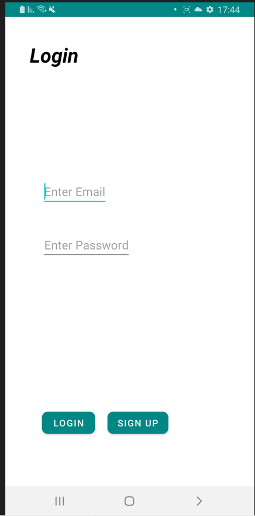
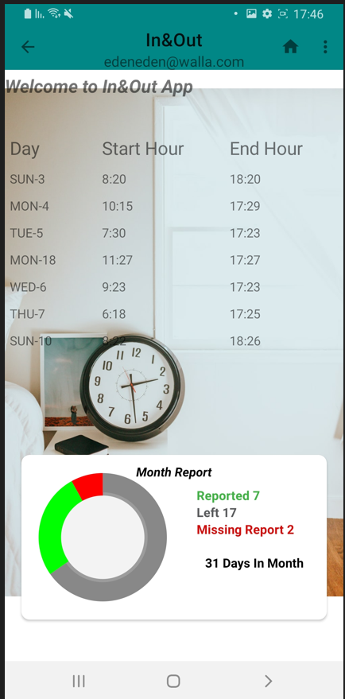
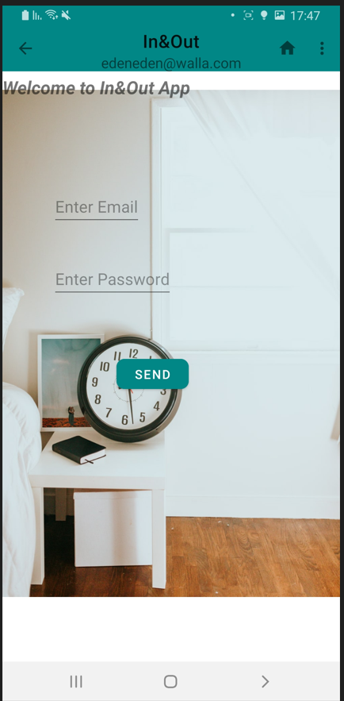

# **_In&Out_**

Time clock app  
Manage your work time clock report.
* User authentication using firebase library.
* Update Hour via Calendar interface.
* Be always update on tour monthly report!
* Desire view for monthly data.
* Can be access from any device in any time - all you need to remember is email and password

### Limitations
 - Requires API level 26 (o) or above.
 - Google play account registered in your device.
 - Android OS only

#### Login page:

#### report:

#### Calender interface:

#### Update Profile:

